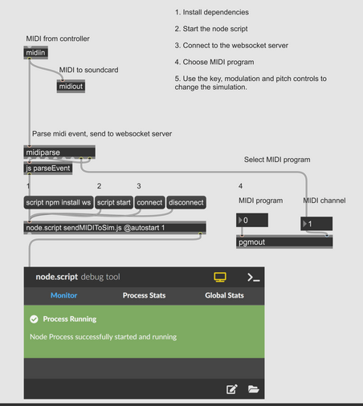
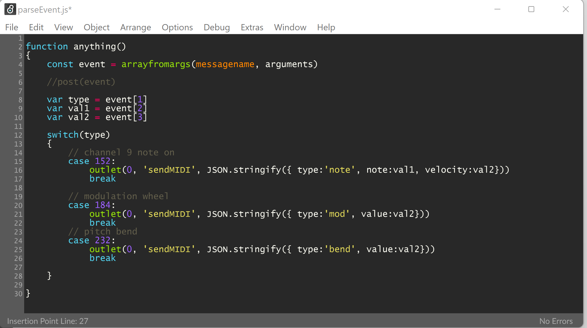
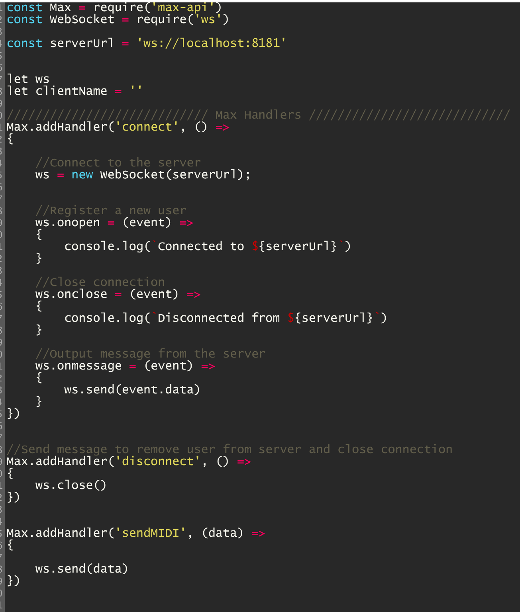
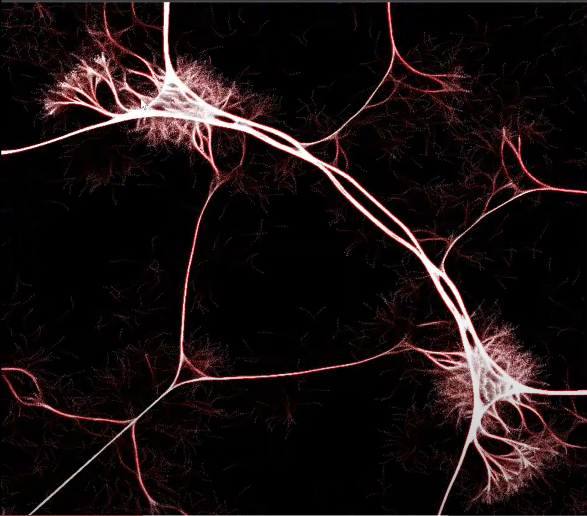

# Physarum controlled by MIDI messages

I used [Max](https://cycling74.com/products/max/), a MIDI controller and MIDI [messages](https://www.midi.org/specifications-old/item/table-1-summary-of-midi-message) to control a Physarum mold  simulation. Max objects are simple to use and enable an artist to rapidly create audio and visual works.
(Max has its own packages for working with video and graphics called [Jitter](https://docs.cycling74.com/max8/tutorials/jitindex)).
I started this project using the [web MIDI API](https://developer.mozilla.org/en-US/docs/Web/API/Web_MIDI_API) and made the decision to use 
max because I was familiar with it from previous classes, and it allows the user to quickly modify/create sounds. [MIDIjs](https://github.com/mudcube/MIDI.js/) and
[WEBMIDI](https://webmidijs.org/) were suggested by professor Roberts and I will experiment with these in the future.

I started by constructing the Max patcher(below).

This patcher receives MIDI messages from the attached MIDI controller using the
midiin object. Messages are then sent to midiout and midparse. The midiout object sends messages to the MIDI output port
and we hear them. The midiparse object is used to obtain the channel(used to set the program) and the midievent [message](https://www.midi.org/specifications-old/item/table-1-summary-of-midi-message).

Midievent messages are then parsed using the parseEvent script.

This script parses the midievent [extended messages](https://www.midi.org/specifications-old/item/table-2-expanded-messages-list-status-bytes) note-on/off, pitch-bend and modulation-wheel.
(only supports controllers using channel 9.)

Parsed midievents are then sent to the websocket client to be sent to the server and routed to 
our simulation.

## Simulation
I added three image processing kernels to the simulation. Two kernels are used for edge detection
and the third is a blur kernel. These are mixed together in the shader.
Controller keypresses send MIDI note-on/off messages which have their velocities mapped to the sensor distance, held keys will keep reporting
their current velocities until the key is released and midi-off message is sent. Velocity is also mapped to the blue channel of the 
decay diffuse shader. The modulation wheel is mapped to the sensing angle and can be used to accelerate growth. Pitch-bend is mapped to 
the alpha of the decay diffuse shader, low values slow down the growth and cause it to become dense, at high values,  the individual particles are easily seen.

# Result
I struggled with this assignment. I tried creating something that differed from my A4 presets, the result is ok. If I had to do it over I would
put more thought and effort into my mappings and post-processing effects. I was really interested in flow fields, but gave up after becoming frustrated with populating
data textures. Another option would have been to learn jitter and to have done everything in Max. 
With some practice, I have been able to create some interesting visuals, but they would
benefit from having more colors/multi colors.

